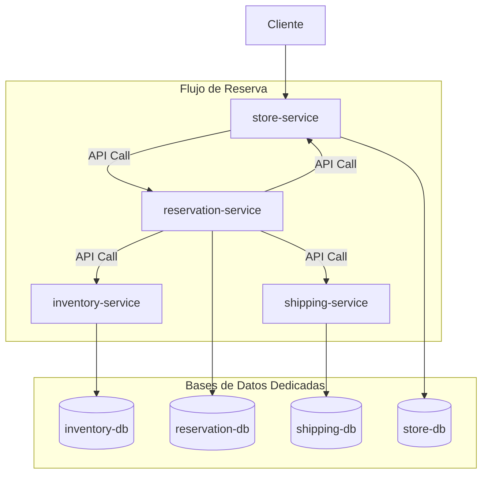

# Arquitectura de Software

El proyecto sigue una arquitectura de microservicios, donde cada servicio es responsable de una capacidad de negocio específica. Este enfoque permite el desarrollo, despliegue y escalado independiente de cada servicio.

## Diagrama de Arquitectura

## Visión General
- El proyecto se organiza como un conjunto de microservicios Node.js independientes (`inventory`, `reservation`, `shipping`, `store`), cada uno con su propio código, dependencias y ciclo de despliegue.
- Cada servicio expone una API REST sobre Express y define puntos de salud (`/health`) para integraciones con plataformas gestionadas como Cloud Run.
- Prisma actúa como capa de acceso a datos en todos los servicios y se genera durante el proceso de build dentro de los containers.

## Microservicios y Dominios
- **Servicio de Inventario (`inventory-service`):** administra stock de productos, movimientos y tipos de movimiento. Publica rutas bajo `/api/stock`, `/api/movimiento` y `/api/tipomovimiento`.
- **Servicio de Reservas (`reservation-service`):** gestiona reservas y estados asociados. Sus endpoints principales se encuentran en `/api/reservas` y `/api/estado`.
- **Servicio de Envíos (`shipping-service`):** orquesta transportistas y envíos mediante rutas `/api/carrier` y `/api/shipping`.
- **Servicio de Tienda (`store-service`):** expone información de tiendas, almacenes y capas geográficas heredadas del contexto de warehouse, agrupadas en rutas `/api` y `/api/*` específicas (departamentos, provincias, distritos, locales, geopoints, etc.).
- Cada servicio reutiliza el mismo patrón de arranque (`src/index.js`): carga de variables con `dotenv`, habilitación de CORS, parseo de JSON y registro de módulos de rutas desacoplados.

## Persistencia
- El `docker-compose` localizado en `infra/docker-compose.dev.yml` provisiona una base de datos PostgreSQL dedicada por microservicio (`inventory-db`, `reservation-db`, `shipping-db`, `store-db`).
- Las credenciales y URLs se inyectan vía variables de entorno definidas en cada servicio (`DATABASE_URL`, `PORT`, etc.), fomentando el aislamiento de datos y la escalabilidad horizontal.
- Los volúmenes `pgdata_*` persisten datos durante sesiones locales de desarrollo.

## Contenedores y Despliegue
- Cada servicio provee un `Dockerfile` basado en `node:18-alpine` que instala dependencias, genera el cliente Prisma y prepara un `docker-entrypoint.sh` común para ejecutar migraciones o seeds antes de iniciar.
- La orquestación local se realiza con Docker Compose, exponiendo puertos 4001-4005 para las APIs y 5433-5437 para las bases de datos.
- Los scripts de despliegue (`deploy-to-cloudrun.ps1`, `deploy-single-service.ps1`) y los endpoints de salud reflejan la intenci��n de desplegar cada microservicio de forma independiente en infraestructura administrada.

## Tecnologías

- **Backend:** Node.js con Express
- **Base de Datos:** PostgreSQL
- **ORM:** Prisma
- **Contenerización:** Docker
- **Orquestación (para desarrollo):** Docker Compose
